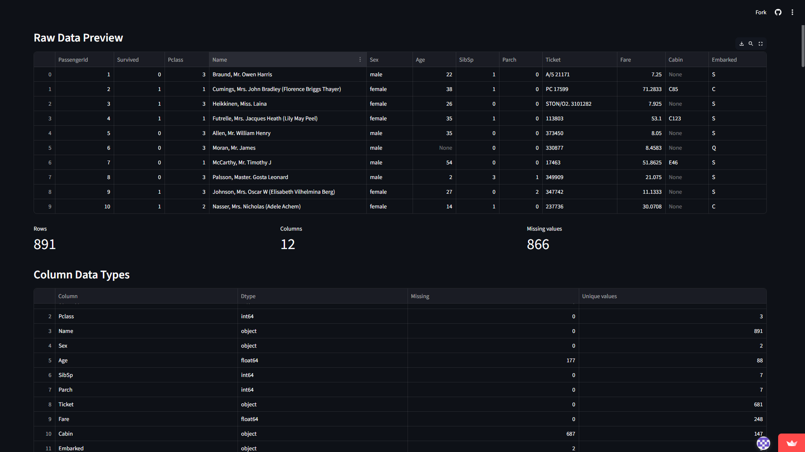
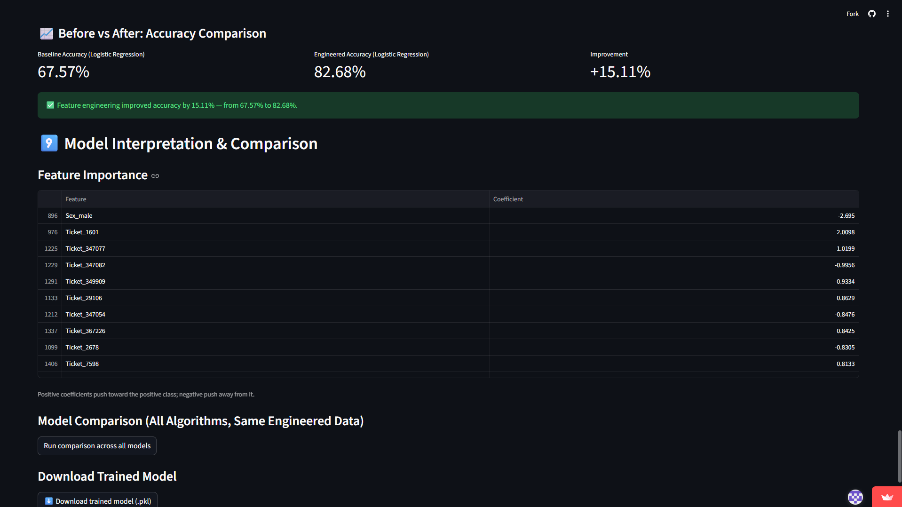

# 📊 Feature Engineering Impact Analyzer

A Streamlit application that demonstrates how **feature engineering improves machine learning performance** by comparing a baseline model trained on raw data with the same model trained on engineered data.

## 🎥 Demo

<p align="center">
  
</p>

## 🌐 Live Demo

🔗 https://feature-engineering-analyzer-slr4etpc88hhfg6b3ouahx.streamlit.app/

---

## ✨ Features

- 📂 Upload any CSV dataset
- 🎯 Automatic target column validation
- 📊 Raw data preview and statistics
- 🧹 Missing value handling
- 📈 Outlier detection and treatment
- ⚖️ Feature scaling (Standard, Min-Max, Robust)
- 🔤 Categorical encoding (Label & One-Hot)
- 🔥 Correlation heatmap
- 🎯 Feature selection
- 🤖 Train multiple ML algorithms
- 📉 Compare baseline vs engineered model
- 📋 Detailed evaluation metrics
- 💾 Download engineered dataset and trained model

---

## 📸 Screenshots

### Data Preview



### Final Results



---

## 🛠 Tech Stack

- Python
- Streamlit
- pandas
- NumPy
- scikit-learn
- matplotlib
- seaborn
- joblib

---

## 🚀 Run Locally

Clone the repository

```bash
git clone https://github.com/sushantkumar31/feature-engineering-analyzer.git
```

Move into the project

```bash
cd feature-engineering-analyzer
```

Install dependencies

```bash
pip install -r requirements.txt
```

Run the application

```bash
streamlit run app.py
```

---

## 📊 Sample Dataset

Titanic Dataset

https://raw.githubusercontent.com/datasciencedojo/datasets/master/titanic.csv

Target Column:

```
Survived
```

---

## 💡 Why This Project?

Most ML tutorials claim that feature engineering improves performance but don't show **how much**.

This application isolates the effect of feature engineering by training the **same algorithm** on:

- Raw data (baseline)
- Engineered data

allowing users to measure the actual improvement in accuracy and other evaluation metrics.

---

## ⭐ If you found this project useful

Please consider giving it a ⭐ on GitHub!
