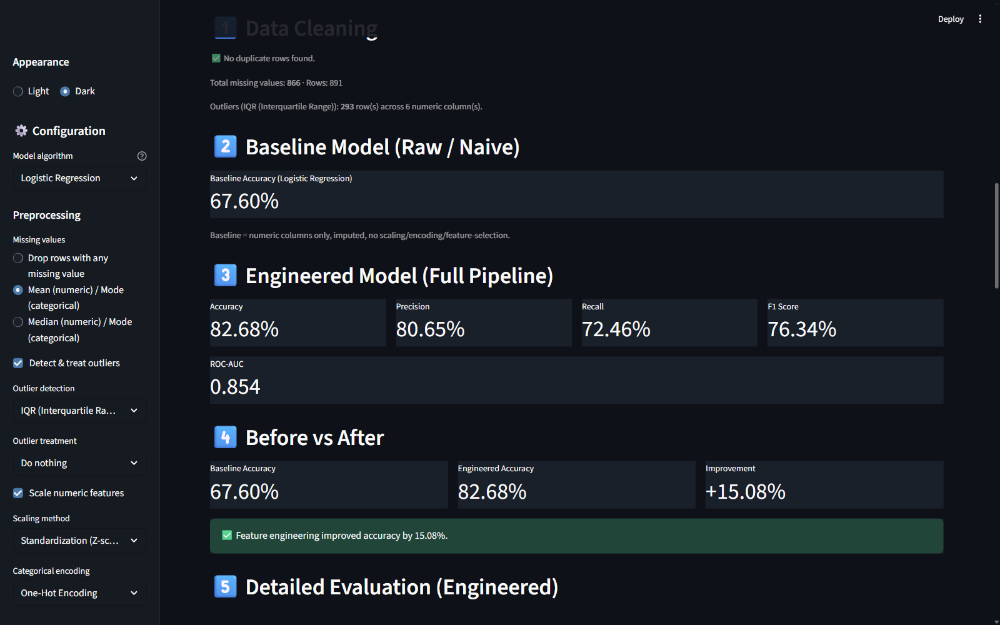
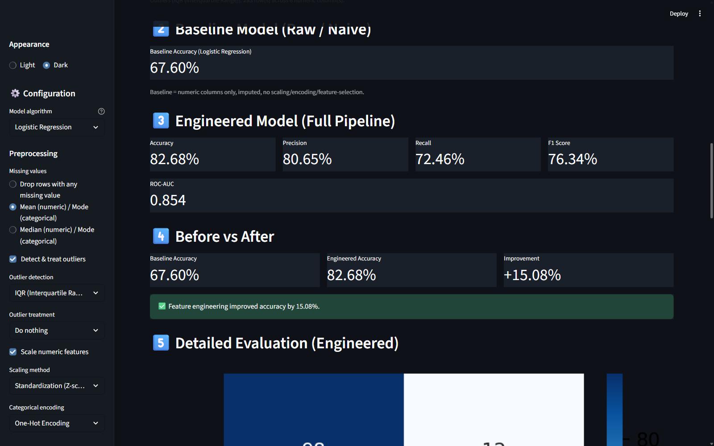

# 📊 Feature Engineering Impact Analyzer

An interactive **Streamlit** application that measures exactly how much **feature engineering** improves machine-learning performance. It trains the **same algorithm** on a raw, naive baseline and on a fully engineered pipeline, then compares both on the **same held-out test set** — so any measured difference is caused by the data transformation, not by the algorithm or by a leaky evaluation.

**Why it matters.** Feature engineering is one of the highest-leverage skills in applied ML, but its benefit is usually asserted, not measured. This tool lets you *quantify* the impact on your own CSV, validate which preprocessing choices help, and export a production-ready pipeline that reproduces your results on new data.

> This is a **classical ML / data-science** application built with scikit-learn. It does not include deep learning or external AI/LLM APIs.

---

## ✨ Features

**Dataset & target**
- Upload any CSV with automatic preview, data-type table, and summary statistics.
- Target validation: rejects constant, ID-like, and continuous (regression) targets; warns on class imbalance and small datasets.

**Preprocessing**
- Duplicate-row detection and removal.
- Missing-value handling: drop rows, mean/mode, or median/mode.
- Outlier detection (IQR / Z-score) and treatment (none, remove, cap, winsorize).
- Scaling: Standardization, Min-Max, Robust.
- Categorical encoding: One-Hot or Label (Ordinal).

**Feature selection**
- Variance Threshold, Correlation-based removal, SelectKBest (ANOVA F-test), Mutual Information, and RFE — all applied inside the pipeline on training data only.

**Modeling & evaluation**
- Six classifiers: Logistic Regression, Decision Tree, Random Forest, K-Nearest Neighbors, SVM, Naive Bayes.
- Metrics: accuracy, precision, recall, F1, ROC-AUC (binary), confusion matrix, classification report, and 5-fold stratified cross-validation.
- Ranked model comparison across all algorithms on the same engineered features.
- Feature importance / coefficient table.
- Correlation heatmap of the engineered feature space.

**Export**
- Download a deployable `pipeline.pkl` that bundles preprocessing + model; load and predict on raw data with `pipe.predict(new_df)`.
- Download the engineered dataset as CSV.

**Appearance**
- Light / Dark theme toggle; charts use transparent backgrounds to blend with either theme.

---

## 📸 Screenshots

Upload view — data preview, target selection, and configuration sidebar:



Results view — baseline vs engineered comparison and detailed evaluation:



---

## 🛠️ Tech Stack

| Category | Technology |
|----------|-----------|
| Language | Python 3.10+ (runtime pinned to 3.12) |
| Framework | Streamlit |
| Data | pandas, NumPy |
| ML | scikit-learn (Pipelines, ColumnTransformer, transformers, selection) |
| Visualization | Matplotlib, Seaborn |
| Serialization | Joblib |
| Testing / Lint | pytest, pytest-cov, Ruff |
| CI | GitHub Actions (Python 3.10 / 3.11 / 3.12) |
| Deployment | Streamlit Community Cloud |

---

## 🚀 Getting Started

Requires **Python 3.10+**.

### 1. Clone the repository

```bash
git clone https://github.com/sushantkumar31/feature-engineering-analyzer.git
cd feature-engineering-analyzer
```

### 2. Create and activate a virtual environment

```bash
python -m venv .venv
.venv\Scripts\activate        # Windows
source .venv/bin/activate     # macOS / Linux
```

### 3. Install dependencies

```bash
pip install -e ".[dev]"
```

This installs the runtime dependencies plus the development tools (`pytest`, `pytest-cov`, `ruff`).

### 4. Run the application

```bash
streamlit run app.py
```

Open [http://localhost:8501](http://localhost:8501) in your browser.

### 5. Run tests and linting

```bash
pytest                              # run the test suite
pytest --cov=fea --cov-report=term-missing   # with coverage
ruff check src app.py tests         # lint
```

---

## 🧪 Testing a sample dataset

Use the classic Titanic dataset:

- **CSV:** `https://raw.githubusercontent.com/datasciencedojo/datasets/master/titanic.csv`
- **Target column:** `Survived`

Upload the CSV, select `Survived`, and run the analysis to see the baseline-vs-engineered comparison.

---

## 🚢 Deployment (Streamlit Community Cloud)

No environment variables are required. The repository includes pinned `requirements.txt`, a `runtime.txt` (Python 3.12), and a `.streamlit/config.toml`.

1. Push the repository to GitHub.
2. Open [Streamlit Community Cloud](https://streamlit.io/cloud) and sign in.
3. Click **Create app** → **Deploy from a repo**.
4. Connect the GitHub repository and select the `main` branch.
5. Set the main file to `app.py`.
6. Click **Deploy** and wait for the build to complete.
7. Verify the app loads and the pipeline runs.

> A live deployment URL is intentionally not listed until a deployment is created and verified.

---

## 📂 Project Structure

```
feature-engineering-analyzer/
├── app.py                      # Streamlit UI (thin presentation layer)
├── src/fea/                    # Core library (UI-independent, testable)
│   ├── __init__.py             # Public API + version
│   ├── config.py               # Enums, constants, PipelineConfig, model registry
│   ├── data.py                 # Loading, validation, summaries
│   ├── preprocessing.py        # Imputation, outliers, scaling, pipeline builder
│   ├── encoding.py             # One-hot / ordinal encoders
│   ├── features.py             # Feature selection (incl. CorrelationThreshold)
│   ├── modeling.py             # Train/evaluate, CV, comparison, importance
│   ├── pipeline.py             # Orchestration + sklearn Pipeline builders
│   └── visualization.py        # Matplotlib/Seaborn figure builders
├── tests/                      # pytest suite (48 tests)
│   ├── conftest.py             # Shared fixtures
│   ├── test_config.py
│   ├── test_data.py
│   ├── test_features.py
│   ├── test_modeling.py
│   ├── test_preprocessing.py
│   └── test_visualization.py
├── assets/                     # README screenshots (preview.png, results.png)
├── .github/workflows/ci.yml    # GitHub Actions (ruff + pytest)
├── .streamlit/config.toml      # Streamlit theme / server config
├── .devcontainer/              # GitHub Codespaces dev container
├── pyproject.toml              # Packaging, Ruff, pytest config
├── requirements.txt            # Pinned runtime deps (Streamlit Cloud)
├── requirements-dev.txt        # Dev deps (pytest, pytest-cov, ruff)
├── runtime.txt                 # Python 3.12 (Streamlit Cloud)
├── .python-version             # Python 3.12
├── .gitignore
├── LICENSE                     # MIT
└── README.md
```

---

## 🔬 Methodology: Leak-Free Evaluation

The core engineering strength of this project is that **no test information leaks into training**:

- The dataset is split into train / test **before** any model fitting.
- Every transformation — imputation, scaling, categorical encoding, and feature selection — is wrapped in a scikit-learn `Pipeline` that is **fitted on the training split only**.
- The **same test split** and the **same algorithm** are used for both the baseline and the engineered model, so any difference is attributable to the feature engineering.
- The exported `pipeline.pkl` reproduces the exact fitted preprocessing + model for deployment.

---

## ⚠️ Limitations

- **Classification only.** The application supports classification targets; regression is not currently supported (continuous targets are rejected during validation).
- **Multi-class ROC-AUC** is not computed (ROC-AUC is reported for binary classification only).
- **Large datasets** may take longer to process, as the analysis re-runs as configuration changes.
- **Model comparison** across all algorithms is intentionally on-demand (button-triggered) for performance.
- **UI testing** is lighter than testing of the core `fea` Python package, which is covered by the pytest suite.

These are deliberate design choices, not defects.

---

## 🗺️ Roadmap (Future Ideas)

These are possible directions, not currently implemented features:

- Regression target support.
- Multi-class ROC-AUC.
- More advanced feature-engineering techniques (polynomial features, interaction terms, binning).
- Better performance on large datasets (e.g., an explicit "Run Analysis" flow, caching, or sampling).
- More robust mobile layout and accessibility improvements.
- Expanded UI-level testing.
- Additional model types (e.g., gradient boosting).

---

## 📄 License

Distributed under the **MIT License**. See [LICENSE](LICENSE).

---

### 🙌 Acknowledgments

Built for data scientists and ML learners who want to see — and prove — the impact of feature engineering. Feedback and contributions are welcome.
